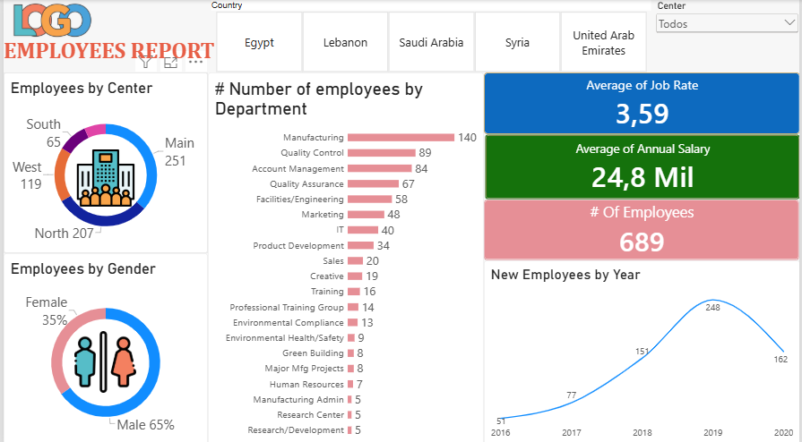

# Dashboard de Funcionários — Power BI

## Sobre o projeto

Este projeto consiste no desenvolvimento de um dashboard
interativo utilizando Power BI, realizado como parte dos meus
estudos em Análise de Dados e Business Intelligence.

O objetivo foi organizar e visualizar informações relacionadas
a funcionários, permitindo explorar indicadores e diferentes
dimensões dos dados.

## Indicadores e análises

- Número total de funcionários
- Média de Job Rate
- Média de salário anual
- Funcionários por centro
- Funcionários por departamento
- Distribuição por gênero
- Novos funcionários por ano
- Filtros por país e centro

## Ferramenta utilizada

- Power BI

## Principais aprendizados

- Criação de dashboards interativos
- Organização e visualização de dados
- Utilização de indicadores e filtros
- Escolha de diferentes tipos de visualização
- Apresentação de informações de forma mais clara e
  acessível para análise

## Prévia do dashboard

